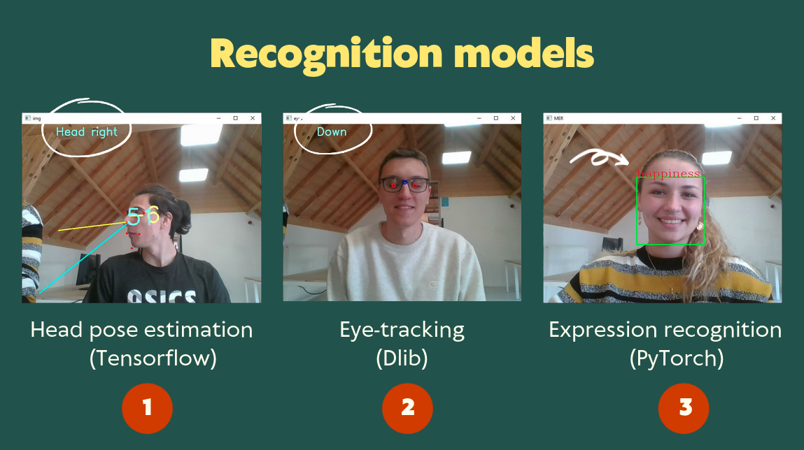
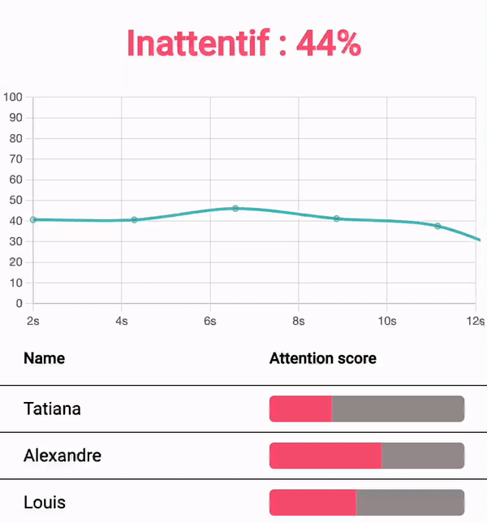
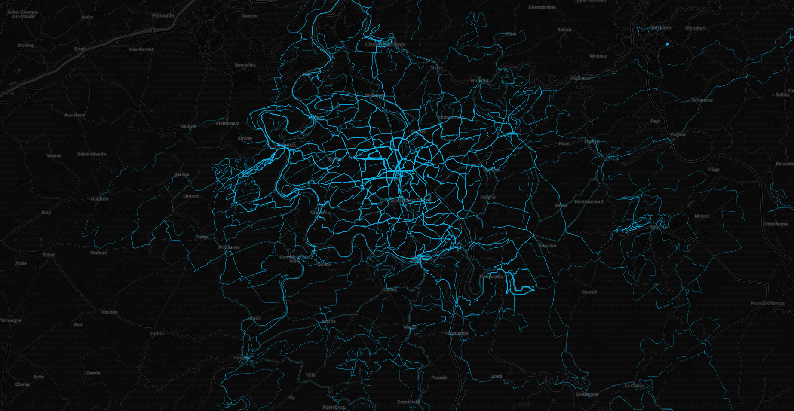
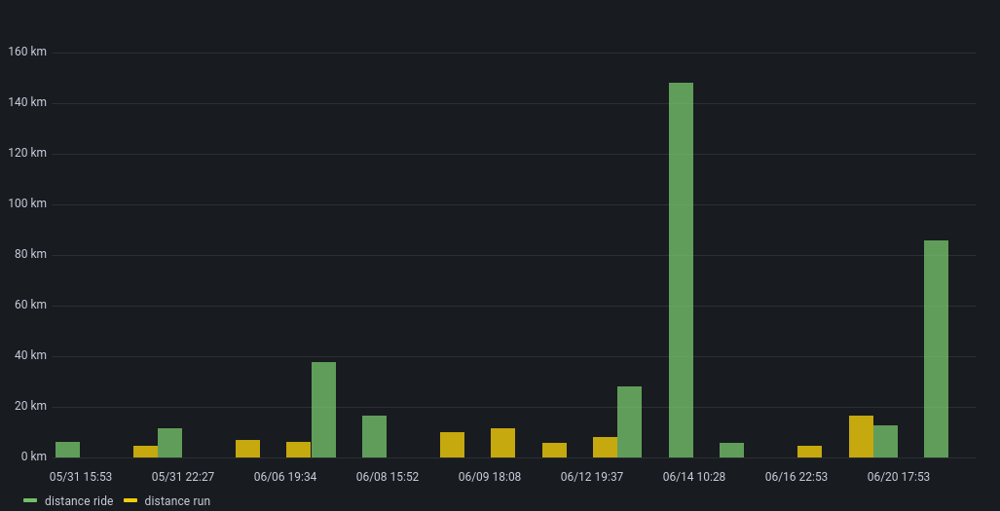
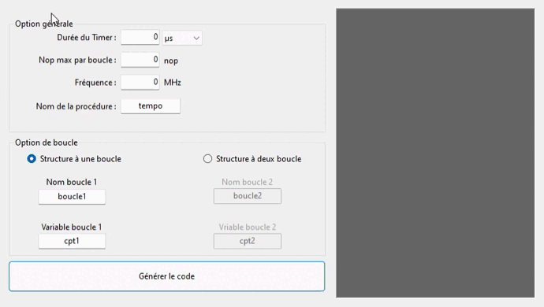
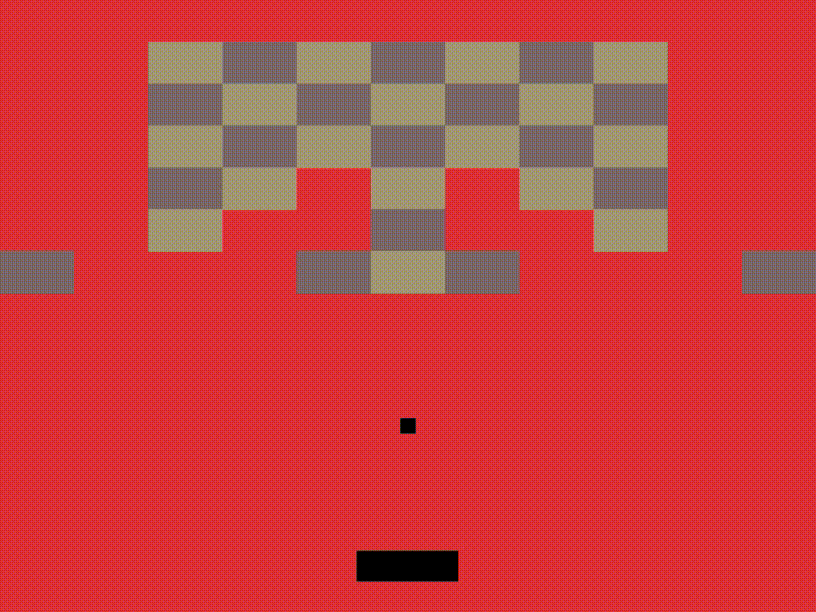

On this page, you will find the list of my programming projects and a small explanation. There will be first a presentation of my biggest projects and then a more global project which includes all kinds of small programs created for school, Leetcode, Rootme or other.

### Table of contents
  - [Odoo Hackaton - Deep Focus](#odoo-hackaton---deep-focus)
  - [Fanuc Fast Dev](#fanuc-fast-dev)
  - [Strava Upgrade](#strava-upgrade)
  - [Microcontrollers timer generator](#Microcontrollers-timer-generator)
  - [Balle Hit](#balle-hit)
  - [Other small programs](#other-small-programs)
  - [_In progress_](#in-progress)
    - Icloud Drive for Linux
    - Create the documentation for Robotic Chess 


## Odoo Hackaton - Deep Focus 
### _The tool to monitor an online class attention rate_

[**_See on Github_**](https://github.com/Xander-Br/LesTouristesOdooHackathon/tree/main)


<figure style="text-align: center">
    
    <figcaption align = "center">
        <b>The different classifier used</b>
        </figcaption>
</figure>


### What is it ?
Deep focus is a tool developed during the Odoo Hackathon 2022. 
We were a team of 3 and got around 30 hours of development time.
It's an chrome extension that help the teacher monitor his online class attention rate on Jitsi.
[Presentation Link](https://www.canva.com/design/DAE8y_2_D1Q/lqdxjrNn8qZnUjsLUs3iMA/view?utm_content=DAE8y_2_D1Q&utm_campaign=designshare&utm_medium=link2&utm_source=sharebutton)

<figure style="text-align: center">
    
    <figcaption align = "center"><b>Result of the Chrome add-on</b></figcaption>
</figure>

### Why we got this idea ?
We are a group of students who all got online class during Covid-19 and for each one of us remarked that a lot of student weren't attentive to the class that the teacher gave.
People are thinking that is always the student fault but they don't know what is to follow long and monotonous class all day long.

### How is it helping ?
The teacher can monitor the class average attention at any time and so he can adapt his class and dynamise it or understand when his students don't understand the subject.

### What to improve ?
- Remove selenium and use the chrome extension to screenshot the call
- Improve and optimize the AI for speed and cost efficiency
- Make dynamic call to the api or implement a bidirectional transaction technology
- Improve web server code
- Add more meet application to the tool (zoom, google meet or teams) 

### How to try it

Firstly you need to install all the library of python

    pip install requirement.txt

Then in the folder /ui execute this command to install all the library

    npm install

Then you need to build and add the extension to chrome

    npm run build

And to add the /dist folder to chrome

You can now launch the api/main.py and scraping/main.py from the backend and voila

### The developer

Breuil Alexandre | [GitHub](https://github.com/Xander-Br) | [LinkedIn](https://www.linkedin.com/in/alexandre-breuil-2003/)
Tatiana Dehon | [GitHub](https://github.com/Titania7)| [LinkedIn](https://www.linkedin.com/in/tatiana-dehon-62ba43198/) 
Louis Gobert | [GitHub](https://github.com/LouisGobert) | [LinkeIn](https://www.linkedin.com/in/louis-gobert-889a2314b/)


## Fanuc Fast Dev
### _Tool to develop faster on fanuc robots_
[**_See on GitHub_**](https://github.com/LouisGobert/FanucFastDev)
### What is it ?
FanucFastdev is a tool developed to convert a C# program into a Fanuc program (.LS).

You just have to create a program with the command : 

    ./Compilator -n [filename]


This will create a new file based on a template (new file is stored in the folder "Workcell/"). You can then program robot movements, activate tools, make conditions, loops, create points, registers.
Once your programming is finished, you can convert your C# file with the command : 

    ./Compilator -b [filename]

This will convert your C# file into an LS file, readable directly by Fanuc robots. You will only have to teach (learn) the different points to the robot.


### Exemple
#### Input
   ```csharp
   static void T_PREMIER_TRAJ()
    {
        ProgramInfo.desc = "Trajectoire facile";
        ProgramInfo.groupMask = "1,*,*,*,*";
        ProgramInfo.type = TP_PROGRAM;
        ProgramInfo.keepBlankLine = true;
        run("T_REPLI");

        Flag flagDemandeQualite = F[1];
        Flag flagTest = F[2];
        flagDemandeQualite.Off();

        if (flagDemandeQualite.State == ON && flagTest.State == OFF || flagTest.State == ON) {
            //! test
            goto autreLabel;
        }
            
        //! par Louis Gobert
        //! Set de UTOOL et UFRAME
        Uframe.set(frameOrange);
        Utool.set(toolPince);
        T_OUV_PINCE();
        Pos pApproche = new Pos(1);
        move.joint(pApproche, 100, 50);
        Pos jRepli = new Pos(2);
        Pos pPrise = new Pos(3);
        PosReg pCalculer = PR[12];
        pCalculer.Desc = "Point calcule";
        PosReg pTemp = PR[11];
        pCalculer.set(pTemp);
        move.joint(jRepli, 12, 100);
        move.linear(pPrise, 123, FINE);
        print("Prise de la piece");
        T_FERM_PINCE();
        move.linear(pApproche, 12, FINE);
        move.joint(jRepli, 12, FINE);

        print("Fin du programme.");

        RO pince = RO[11];

        if (pince.State == ON)
        {
            goto lablTest;
        } else
        {
            goto autreLabel;
        }
    autreLabel:
        if (RO[1].State == OFF)
        {
            print("Fermer");
        }
        if (RO[12].State == ON)
        {
            print("12 fermer");
        }
    lablTest:
        print("Arrive au label");
    }
```

#### Output
```
/PROG  T_PREMIER_TRAJ
/ATTR
OWNER       = MNEDITOR;
COMMENT     = "Trajectoire facile";
PROG_SIZE   = 1382;
CREATE      = DATE 20-10-15  TIME 15:42:30;
MODIFIED    = DATE 20-10-15  TIME 16:10:46;
FILE_NAME   = ;
VERSION     = 0;
LINE_COUNT  = 55;
MEMORY_SIZE = 1662;
PROTECT     = READ_WRITE;
TCD:  STACK_SIZE        = 0,
      TASK_PRIORITY     = 50,
      TIME_SLICE        = 0,
      BUSY_LAMP_OFF     = 0,
      ABORT_REQUEST     = 0,
      PAUSE_REQUEST     = 0;
DEFAULT_GROUP   = 1,*,*,*,*;
CONTROL_CODE    = 00000000 00000000;
/APPL
/MN
   1:   ;
   2:  RUN T_REPLI ;
   3:   ;
   4:  F[1]=OFF ;
   5:   ;
   6:  IF (F[1]=ON AND F[2]=OFF OR F[2]=ON) THEN ;
   7:  !test ;
   8:  JMP LBL[1] ;
   9:  ENDIF ;
  10:   ;
  11:   ;
  12:   ;
  13:  !par Louis Gobert ;
  14:  !Set de UTOOL et UFRAME ;
  15:  UFRAME_NUM=4 ;
  16:  UTOOL_NUM=1 ;
  17:  CALL T_OUV_PINCE    ;
  18:   ;
  19:J P[1] 100% CNT50    ;
  20:   ;
  21:   ;
  22:  PR[12:Point calcule]=PR[11]    ;
  23:   ;
  24:J P[2] 12% CNT100    ;
  25:L P[3] 123mm/sec FINE    ;
  26:  MESSAGE[Prise de la piece]  ;
  27:  CALL T_FERM_PINCE    ;
  28:   ;
  29:L P[1] 12mm/sec FINE    ;
  30:J P[2] 12% FINE    ;
  31:   ;
  32:  MESSAGE[Fin du programme.]  ;
  33:   ;
  34:   ;
  35:  IF (RO[11]=ON) THEN ;
  36:  JMP LBL[2] ;
  37:  ELSE  ;
  38:  JMP LBL[1] ;
  39:  ENDIF ;
  40:  LBL[1:autreLabel] ;
  41:   ;
  42:  IF (RO[1]=OFF) THEN ;
  43:  MESSAGE[Fermer]  ;
  44:  ENDIF ;
  45:  IF (RO[12]=ON) THEN ;
  46:  MESSAGE[12 fermer]  ;
  47:  ENDIF ;
  48:   ;
  49:   ;
  50:   ;
  51:   ;
  52:  LBL[2:lablTest] ;
  53:  MESSAGE[Arrive au label]  ;
  54:   ;
  55:   ;
/POS
P[1]{
   GP1:
    UF : 0, UT: 1, 
    J1=     0.000 deg,  J2=     0.000 deg,  J3=     0.000 deg,
    J4=     0.000 deg,  J5=     0.000 deg,  J6=     0.000 deg
};
P[2]{
   GP1:
    UF : 0, UT: 1, 
    J1=     0.000 deg,  J2=     0.000 deg,  J3=     0.000 deg,
    J4=     0.000 deg,  J5=     0.000 deg,  J6=     0.000 deg
};
P[3]{
   GP1:
    UF : 0, UT: 1, 
    J1=     0.000 deg,  J2=     0.000 deg,  J3=     0.000 deg,
    J4=     0.000 deg,  J5=     0.000 deg,  J6=     0.000 deg
};
/END
```
### The developer, just me

Louis Gobert | [GitHub](https://github.com/LouisGobert) | [LinkedIn](https://www.linkedin.com/in/louis-gobert-889a2314b/)


## Strava Upgrade
### _Monitor your Strava activities_
[**_See on GitHub_**](https://github.com/LouisGobert/StravaUpgrade)

### What is it ?
This application allows us to connect to our strava account via the official Srava REST API. Then download the GPX tracks of the courses to create a heatmap (with [this plugin](https://github.com/erik/derive)). I also download different statistics (number of km run, elevation gain, time, caridactic frequency,...) that I store in a TimeSeries Database (InfluxDB) in order to create visualizations in Grafana.
<figure style="text-align: center">
    
    <figcaption align = "center"><b> Heatmap exemple</b></figcaption>
</figure>
<figure style="text-align: center">
    
    <figcaption align = "center"><b>Result in Grafana</b></figcaption>
</figure>


## Microcontrollers Timer Generator
### _Allows to generate microsecond accurate loops for microcontrollers_
[**_See on GitHub_**](https://github.com/LouisGobert/NopTimerGenerator)
<figure style="text-align: center">
    
    <figcaption align = "center">
        <b>Example of code generation</b>
    </figcaption>
</figure>

## Balle Hit
### _Simple brick-breaking game_
[**_See on GitHub_**](https://github.com/LouisGobert/BalleHit)

<figure style="text-align: center">
    
    <figcaption align = "center"><b> Heatmap exemple (slow due to the conversion to gif)</b></figcaption>
</figure>


## Other small programs

_[See on GitHub](https://github.com/LouisGobert/dev)_

The github repository is broken down into several folders
 - Leetcode
 - Web
 - Rootme

## In progress

I am currently developing a software that will allow to have a "native" Icloud Drive file explorer on Linux (as already available on Windows)

### Robotic Chess

#### What is it ?

It is a program with two parts: a server and a client. The client is a simple web page (developed with the React.js Framework) that allows you to play chess against the server.
The server (developed with the django Framework) contains a MinMax algorithm that allows to find the best move to play (for the computer, enemi of the player).
I realized this project for two CS50 courses, one teaching us the basics of Artificial Intelligence and the other one teaching us Django.
